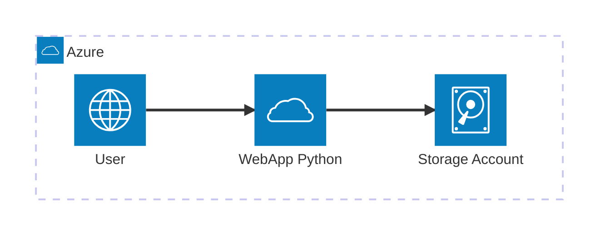

# Debt Analysis API

A Flask-based REST API for analyzing customer debt scenarios, including minimum payment, optimized payment, and consolidation strategies. The API connects to Azure Blob Storage using Managed Identity to fetch customer data.

## Features

-   **Minimum Payment Analysis**: Calculate payoff timeline with minimum payments
-   **Optimized Payment Analysis**: Calculate accelerated payoff using available cashflow
-   **Consolidation Analysis**: Evaluate consolidation offers and potential savings
-   **Azure Storage Integration**: Secure data access via Managed Identity (DefaultAzureCredential)
-   **Singleton Pattern**: Efficient Azure Storage connection management
-   **Comprehensive Error Handling**: Detailed error responses for various scenarios

## Architecture

The application follows the Single Responsibility Principle with the following components:



The project is structured as follows:
```
flask-debt-analysis-api/
│
├── app/
│   ├── __init__.py              # Flask app factory export
│   ├── main.py                  # Flask app factory with initialization
│   ├── config.py                # Configuration from env variables
│   │
│   ├── api/
│   │   ├── __init__.py
│   │   ├── health.py            # GET /health endpoint
│   │   └── analyze.py           # POST /api/analyze endpoint
│   │
│   ├── services/
│   │   ├── __init__.py
│   │   └── analyze_service.py   # Service layer with singleton data loading
│   │
│   ├── clients/
│   │   ├── __init__.py
│   │   └── blob_singleton.py    # Azure Blob Storage singleton client
│   │
│   └── core/
│       ├── __init__.py
│       └── debt_analyzer.py     # Your original debt analysis logic
│
├── .env.example                 # Environment variable template
├── requirements.txt
├── run.py                       # Application entry point
└── openapi.yml                  # Your existing OpenAPI spec
```

## Prerequisites

-   Python 3.10+
-   Azure Storage Account with Managed Identity enabled
-   The following files in Azure Blob Storage (container: `files`), this documents can be found in the folder `resources` located in the project root:
    -   `loans.csv`
    -   `cards.csv`
    -   `payments_history.csv`
    -   `credit_score_history.csv`
    -   `customer_cashflow.csv`
    -   `bank_offers.json`

## Setup

### 1. Install Dependencies

```bash
pip install -r requirements.txt
```

### 2. Configure Environment Variables

Copy `.env.example` to `.env` and configure:

```bash
cp .env.example .env
```

Edit `.env`:

```env
AZURE_STORAGE_ACCOUNT_NAME=your_storage_account_name
CONTAINER_NAME=files
```

### 3. Azure Managed Identity Setup

Ensure your application has a Managed Identity with the following permissions:

-   **Role**: `Storage Blob Data Reader`
-   **Scope**: Your Azure Storage Account

For local development, you can use Azure CLI authentication:

```bash
az login
```

### 4. Run the Application (on Windows console)

```bash
python run.py
```

## API Endpoints

### Health Check

**GET** `/health`

Check if the API is running and data is loaded.

**Response:**

```json
{
  "status": "healthy",
  "data_loaded": true
}
```

### Analyze Debt

**POST** `/api/analyze`

Analyze debt scenarios for a customer and product.

**Request:**

```json
{
  "customer_id": "CU-001",
  "product_type": "loan"
}
```

**Response:**

```json
{
  "customer_id": "CU-001",
  "product_type": "loan",
  "product_id": "LN-001",
  "scenarios": {
    "minimum_payment": {
      "scenario_name": "Minimum Payment",
      "summary": {
        "original_balance": 25000.00,
        "total_paid": 35678.90,
        "total_interest": 10678.90,
        "months_to_payoff": 120,
        "monthly_payment_avg": 297.32
      },
      "monthly_projection": [...]
    },
    "optimized_payment": {
      "scenario_name": "Optimized Payment",
      "summary": {
        "original_balance": 25000.00,
        "total_paid": 29234.56,
        "total_interest": 4234.56,
        "months_to_payoff": 65,
        "monthly_payment_avg": 449.76,
        "safe_monthly_allocation": 500.00
      },
      "monthly_projection": [...]
    },
    "consolidation": {
      "scenario_name": "Consolidation",
      "eligible": true,
      "offer_id": "OFFER-001",
      "offer_details": {
        "new_rate_pct": 4.5,
        "new_term_months": 60,
        "original_rate_pct": 8.5
      },
      "summary": {
        "original_balance": 25000.00,
        "total_paid": 28456.78,
        "total_interest": 3456.78,
        "months_to_payoff": 60,
        "monthly_payment": 474.28
      },
      "monthly_projection": [...]
    }
  },
  "comparison": {
    "minimum_payment": {
      "total_paid": 35678.90,
      "total_interest": 10678.90,
      "months": 120
    },
    "optimized_payment": {
      "total_paid": 29234.56,
      "total_interest": 4234.56,
      "months": 65,
      "savings_vs_minimum": {
        "interest_saved": 6444.34,
        "total_saved": 6444.34,
        "time_saved_months": 55
      }
    },
    "consolidation": {
      "total_paid": 28456.78,
      "total_interest": 3456.78,
      "months": 60,
      "savings_vs_minimum": {
        "interest_saved": 7222.12,
        "total_saved": 7222.12,
        "time_saved_months": 60
      }
    }
  }
}
```

## Error Handling

The API returns standardized error responses:

```json
{
  "error": "No loan found for customer CU-001",
  "error_type": "ANALYSIS_ERROR",
  "details": {}
}
```

**Error Types:**

-   `VALIDATION_ERROR` - Invalid request data
-   `ANALYSIS_ERROR` - Customer/product not found
-   `FILE_NOT_FOUND` - Azure blob not found
-   `AZURE_CONNECTION_ERROR` - Azure connection issues
-   `SERVICE_NOT_READY` - Data not loaded
-   `INTERNAL_ERROR` - Unexpected server error
-   `NOT_FOUND` - Endpoint not found
-   `METHOD_NOT_ALLOWED` - Invalid HTTP method

## Testing

### Using cURL

```bash
# Health check
curl http://localhost:5000/health

# Analyze loan
curl -X POST http://localhost:5000/api/analyze \
  -H "Content-Type: application/json" \
  -d '{"customer_id": "CU-001", "product_type": "loan"}'

# Analyze credit card
curl -X POST http://localhost:5000/api/analyze \
  -H "Content-Type: application/json" \
  -d '{"customer_id": "CU-002", "product_type": "card"}'
```

### Using Python

```python
import requests

response = requests.post(
    'http://localhost:5000/api/analyze',
    json={
        'customer_id': 'CU-001',
        'product_type': 'loan'
    }
)

print(response.json())
```

## Deployment

### Azure App Service

1.  Create an App Service with Managed Identity enabled
2.  Assign `Storage Blob Data Reader` role to the Managed Identity
3.  Configure environment variables in App Service settings
4.  Deploy the application

### Docker

```dockerfile
FROM python:3.10-slim

WORKDIR /app

COPY requirements.txt .
RUN pip install --no-cache-dir -r requirements.txt

COPY . .

CMD ["gunicorn", "--bind", "0.0.0.0:5000", "app:app"]
```

## Data Loading Strategy

-   **On Startup**: All CSV and JSON files are loaded from Azure Storage once at application startup
-   **Caching**: Data is cached in memory for the lifetime of the application
-   **No Refresh**: The API does not reload data on each request for optimal performance
-   **Singleton Pattern**: Azure Storage connection is created once and reused

## License

This project is provided as-is for educational purposes.